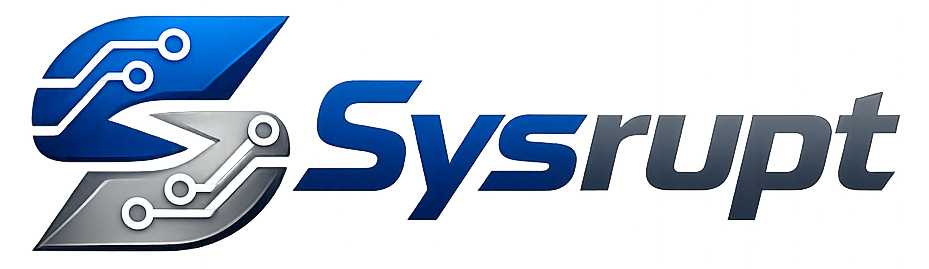
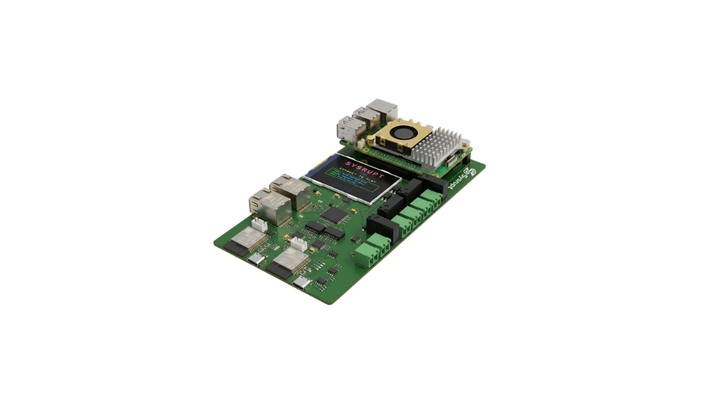
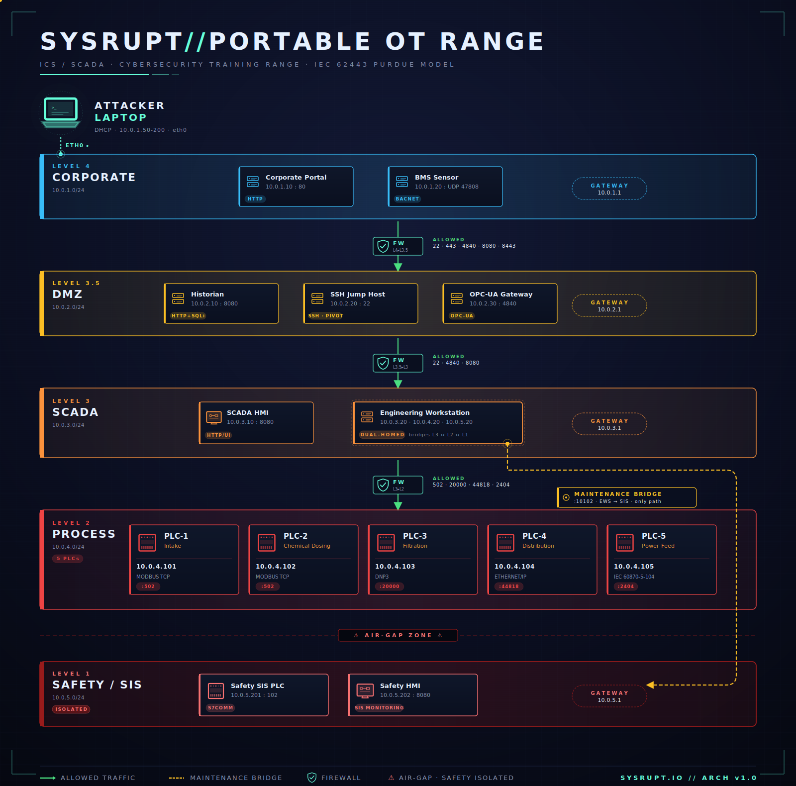
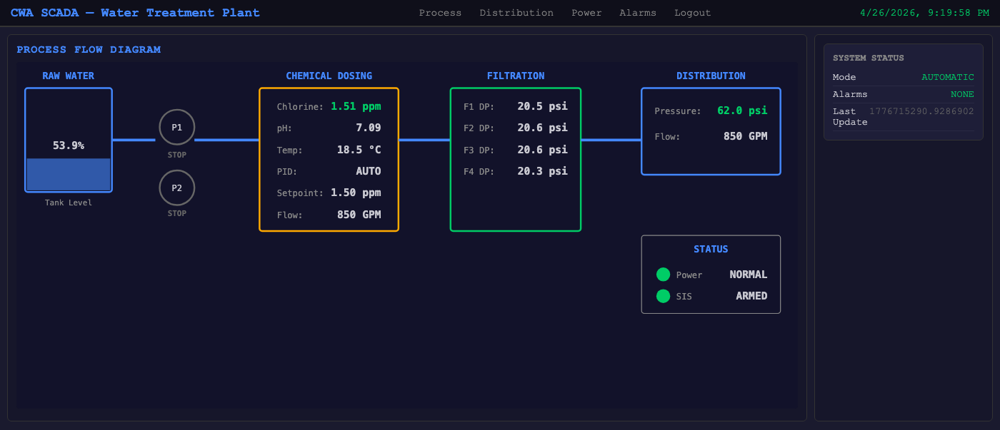
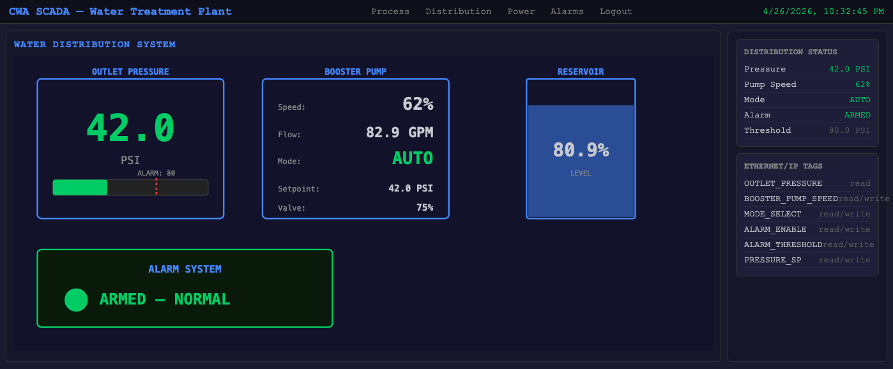
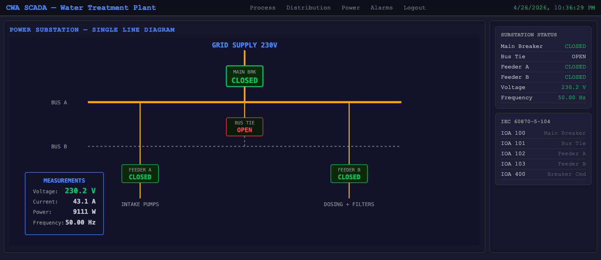

<p align="center">
  
</p>

<p align="center">
  <strong>Portable OT Range  - A hands-on ICS/SCADA cybersecurity training platform that fits in your backpack.</strong>
</p>

<p align="center">
  
</p>

## Overview

Plug in an Ethernet cable. Hack a water treatment plant. Learn ICS/SCADA security.

The Sysrupt Portable OT Range is a complete industrial cybersecurity training lab running on a single purpose-built **Sysrupt** appliance. It simulates a real water treatment facility with 5 network zones, 8 industrial protocols, and 10 progressive CTF challenges.

Built for conferences, red team training, university labs, and security workshops. Zero cloud dependency. Boots in 90 seconds. Runs anywhere.

## Architecture

<p align="center">
  
</p>

Five network zones following the **IEC 62443 Purdue Reference Model**:

| Zone | Subnet | What's Inside |
|------|--------|---------------|
| **Corporate** | 10.0.1.0/24 | Web portal, building management system |
| **DMZ** | 10.0.2.0/24 | Historian, OPC-UA gateway, SSH jump host |
| **SCADA** | 10.0.3.0/24 | HMI with live process visualization, engineering workstation |
| **Process** | 10.0.4.0/24 | 5 PLCs running Modbus, DNP3, EtherNet/IP, IEC 104 |
| **Safety** | 10.0.5.0/24 | Safety Instrumented System (air-gapped... or is it?) |

### SCADA HMI - Live Process Visualisation

Every attack has visible, physical impact on the operator's screen. Mess with the dosing pump, the chlorine reading climbs in real time. Trip the substation breaker, the single-line diagram goes red.

<p align="center">
  
  <br/><em>Process overview: tank levels, dosing, filtration, distribution, system status</em>
</p>

<p align="center">
  
  <br/><em>Distribution system: pressure gauge, booster pump, reservoir, EtherNet/IP tags</em>
</p>

<p align="center">
  
  <br/><em>Power substation: single-line diagram with breakers, IEC 60870-5-104 tags</em>
</p>

## Protocols

Eight real industrial protocols, each running as a dedicated service:

| Protocol | Port | Real-World Use |
|----------|------|----------------|
| **HTTP** | 80 | Corporate systems, SCADA web interfaces |
| **OPC-UA** | 4840 | Industrial data exchange (Industry 4.0) |
| **BACnet/IP** | 47808 (UDP) | HVAC, lighting, access control |
| **DNP3** | 20000 | Power grids, water utilities |
| **EtherNet/IP** | 44818 | Rockwell/Allen-Bradley factory automation |
| **IEC 60870-5-104** | 2404 | European power grid SCADA |
| **Modbus TCP** | 502 | PLCs, RTUs, chemical dosing systems |
| **S7comm** | 102 | Siemens safety controllers |

## Challenges

Ten progressive challenges that mirror real-world attack chains:

| # | Challenge | Points | What You'll Do |
|---|-----------|--------|----------------|
| 1 | Perimeter Breach | 100 | Scan, exploit web vulnerabilities, gain initial access |
| 2 | Intelligence Gathering | 200 | Browse OPC-UA, extract plant credentials |
| 3 | Pivot to OT | 300 | SQL injection, SSH tunneling across zones |
| 4 | Building Recon | 350 | Discover hidden UDP services, explore BACnet |
| 5 | Deep Protocol: DNP3 | 400 | Decode protocol data, solve a CRC challenge |
| 6 | Silent Overpressure | 450 | Disable alarms, cause damage without detection |
| 7 | Power Blackout | 500 | Trip a substation breaker, watch the HMI go dark |
| 8 | Process Manipulation | 600 | Override PID controller, manipulate chemical dosing |
| 9 | Safety Assault | 800 | Find a hidden bridge, bypass the safety system |
| 10 | Full Compromise | 1000 | Combine everything, push chlorine to lethal levels |

**Auto-detection** means no manual flag submission. Hack the system and the scoreboard updates. A 320x240 display shows real-time progress, hints, and retro arcade celebrations.

## Under the Hood

Everything runs on a single Sysrupt appliance:

- **16 Linux network namespaces** for zone isolation
- **5 bridge networks** with iptables firewall rules
- **23 services** (PLCs, web apps, SSH servers, physics engine, IDS)
- **Physics engine** simulating chlorine dosing, tank levels, power grid
- **SCADA HMI** with live gauges: pressure, chlorine, breaker states
- **CTF engine** monitoring Redis for auto-detection

Students connect via Ethernet. DHCP assigns an IP in the corporate zone. From there, they scan, exploit, and pivot deeper into the plant.

## Getting Started

### What You Need
- Kali Linux laptop (or any Linux with Python 3)
- Ethernet cable
- The Sysrupt board

### Student Setup
```bash
# Install tools
cd kali-setup
sudo bash kali-setup.sh

# Plug Ethernet into the OT Range
# Start hacking
nmap -sT 10.0.1.0/24
```

### Protocol Tools

Six custom protocol explorers included:

```bash
python3 ~/tools/bacnet-tool.py  -h    # BACnet/IP
python3 ~/tools/dnp3-tool.py    -h    # DNP3
python3 ~/tools/enip-tool.py    -h    # EtherNet/IP
python3 ~/tools/iec104-tool.py  -h    # IEC 60870-5-104
python3 ~/tools/modbus-tool.py  -h    # Modbus TCP
python3 ~/tools/s7comm-tool.py  -h    # S7comm (Siemens)
```

## Challenge Guide

Progressive hints for each challenge (no spoilers):

| Challenge | Guide |
|-----------|-------|
| 1. Perimeter Breach | [ch01.md](docs/challenges/ch01.md) |
| 2. Intelligence Gathering | [ch02.md](docs/challenges/ch02.md) |
| 3. Pivot to OT | [ch03.md](docs/challenges/ch03.md) |
| 4. Building Recon | [ch04.md](docs/challenges/ch04.md) |
| 5. Deep Protocol: DNP3 | [ch05.md](docs/challenges/ch05.md) |
| 6. Silent Overpressure | [ch06.md](docs/challenges/ch06.md) |
| 7. Power Blackout | [ch07.md](docs/challenges/ch07.md) |
| 8. Process Manipulation | [ch08.md](docs/challenges/ch08.md) |
| 9. Safety Assault | [ch09.md](docs/challenges/ch09.md) |
| 10. Full Compromise | [ch10.md](docs/challenges/ch10.md) |

## Hardware

Sysrupt is a purpose-built ICS training appliance built around a 4-layer custom PCB designed in Altium Designer.

- **Sysrupt compute core** running a hardened Linux build
- **ESP32-C6** modules for PLC and IIoT simulation
- **ILI9341** 320x240 SPI display (scoreboard)
- **RTL8367S** managed Ethernet switch (5 ports)
- **USB-C PD** power delivery
- Status LEDs and expansion headers

Design files in `hardware/`:

| Directory | Contents |
|-----------|----------|
| `Source/` | Altium schematic (.SchDoc) and PCB layout (.PcbDoc) |
| `Gerber/` | Manufacturing files (ready for fabrication) |
| `BOM/` | Bill of materials |
| `3D/` | STEP model for mechanical integration |

## Real-World Relevance

The attack chain mirrors techniques from real incidents:

| Attack | Year | Technique in This Range |
|--------|------|------------------------|
| **Stuxnet** | 2010 | PLC manipulation + safety system bypass |
| **Ukraine Power Grid** | 2015 | IEC 104 breaker trip commands |
| **TRITON / TRISIS** | 2017 | Safety Instrumented System compromise |
| **Oldsmar Water Plant** | 2021 | Remote chemical dosing manipulation |

## License

MIT License. See [LICENSE](LICENSE) for details.

## Acknowledgements

Portions of the codebase were co-authored with Anthropic's Claude.
